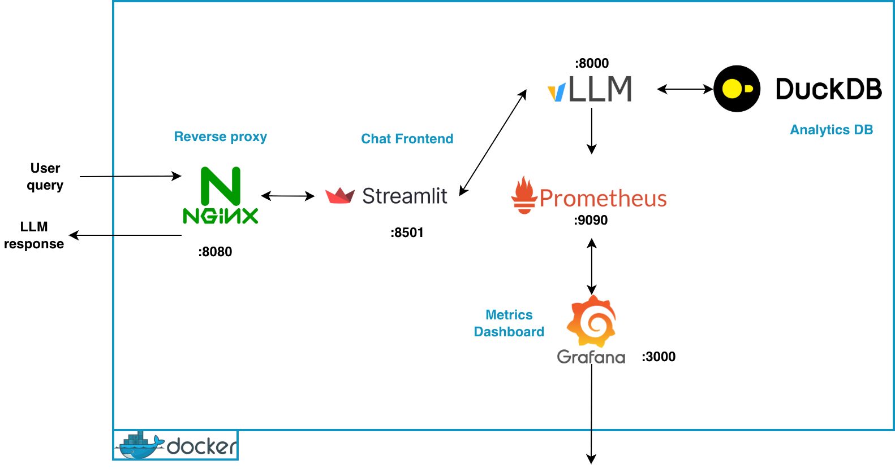

# Chat with PDF using vLLM + LangChain
A minimalistic, high-performance RAG application designed to translate natural language into Safe SQL to monitor election results, rankings, turnout, and more.

## A - Description
This is a `chat with your document` app implemented as a solution to the set of challenges for an AI Engineer position. Below are the overall objectives:

 - Answer factual questions grounded in the PDF,
 - Compute aggregations/rankings,
 - Generate charts on demand,
 - Progressively improve robustness, safety, and production readiness.

The typical workflow can be described as follows: _the user types a question/query and the assistant returns an answer derived `only from the
PDF`._

### Technical constraints and key criteria:
The user:
- gets answers based `only on the PDF content`.
- can ask for counts, rankings, and summaries.
- can request a chart (e.g., histogram/bar chart) and receive it inline.

If the information is not in the dataset, the assistant
clearly says so.

- The PDF is the only allowed data source.
- `Section B` provides reproducible setup instructions, while execution instructions are provided under each level.
- We do our best to cap query results and implement protection against runaway queries.

Data handling:
- PDF extraction must handle repeated headers/footers, page numbers, broken
lines, and tables.
- Ensure entity normalization (e.g., accents/casing) is documented.

Security:
- We do our best not to allow destructive DB operations.
- We do our best not to execute arbitrary code from the model.
- [Addition] 🔒 100% Local/internal - All processing happens on the target machine, no data leaves and no external API calls.

Additional constraints (language):
- The overall (main) language used in this project is English. However, we make sure natural language requests can be sent in French...but processed in English in the backend.

## B - Setup and Execution Instructions

### Project Structure
TBA


### Overall Approach
The challenge is structured from Level 1 to Level 4.
#### L1 - Text-to-SQL Agent 
Goal: Build a chat app that answers aggregation / ranking / chart questions by translating the
user request into safe SQL, executing it on a structured dataset extracted from the PDF, and
formatting the result.

#### L2 - Hybrid Router (SQL + RAG for fuzziness, narrative, grounding)
Goal: Improve robustness by adding a hybrid router:
- SQL path for analytics (counts/rankings/charts)
- RAG path for fuzzy lookup, narrative explanations, and grounding.

#### L3 - Improved Agentic (clarification + disambiguation + multi-step)
Goal: Make the assistant behave like a real agent; it should ask clarifying questions when
needed or run disambiguation automatically.

#### L4 - Advanced (observability + evaluation + reliability)
Goal: Add production-grade tooling: evaluation pipelines and observability to measure and
debug system quality.

#### How we decided to address the challenge

Although the challenge is structured that way, we have organized our project based on practicality and seamless integration.
In fact, some components of the stack are easily built together so we followed out own path through the predefined levels.



We designed the main stack after reviewing the project requirements (see above figure).

#### Target machine specs
- Dev: Macbook M4
    - RAM: ~16 GB
    - Storage: 50-100 GB
- Tested OS: Unix-based, Darwin (Mac)

PS: The target environment is either GPU- or CPU-based and is not conditioned on the dev environment. 
Runnning the app on CPU was mainly for debugging and benchmarking purposes, but it happend to be sufficient to have a working stack.

#### Main Stack
- **Docker**: Containerization tool to package the entire stack for consistent deployment across environments.
#### LLM / Agent orchestration
- **vLLM**: High-throughput engine for serving LLMs with optimized memory management.
- **LangChain**: Orchestration framework that links your prompts, retrieval logic, and LLM calls.

#### Data/Metrics Visualization

- **Prometheus**: Time-series database that scrapes and stores metrics from vLLM and your Python app.
- **Grafana**: Visualization platform to view the JSON dashboard and monitor your system health.

#### Frontend
- **Streamlit**: Python-based web framework for building a clean chat interface with minimal frontend code.

#### General Backend
- **Python >=3.12**: The primary programming language used for logic, data processing, and glue code.
- **pdfblumber**: Surgical tool for Digital PDFs which doesn't "guess" where a character is but asks the PDF file for the exact X/Y coordinates of every letter and line. 

    - We refrain from using vision-language models (VLMs) like Qwen-VL, Dots OCR, DeepSeek OCR or any LM-based OCR model, to avoid unwanted "hallucinations" of the text based on pixels. 
    - In our case where each decimal point/digit matters, `pdfplumber` (or any of its likes) seems more accurate because it extracts the raw data.
    - We also do not want to allocate additional compute resources to run VLMs in addition to our base LLM(s). However, we do acknowledge VLMs as a more generic way of handling various PDF layouts out of the box
    - See [notebooks/pdf_data_extraction.ipynb](notebooks/pdf_data_extraction.ipynb) for more details about our experiments with the target dataset and how the data extraction pipeline was tailored to the subject matter given we had only one PDF to consider as data source.

### Step 1
Once we found a sufficient design, we started by making sure components are properly implemented within the docker environment with with the appropriate parameters:
- vLLM (foundation)
- Prometheus and Grafana (for observability)
- Streamlit (UI/Access)
- Nginx (reverse proxy)

See [docker-compose.yml](docker-compose.yml) for more details about how these components are interconected.

Note that the observability/monitoring aspects were taken care of during the design and initialization of the stack since it allows easy debugging of the system.

#### Setup instructions
Make sure docker is already installed on the host machine. Installation details can be found at [subfuzion/install-docker-ubuntu.md](https://gist.github.com/subfuzion/90e8498a26c206ae393b66804c032b79) on GitHub Gist.

Typically, it can be done by running the following command line:
```sh
$ curl -fsSL https://get.docker.com/ | sh
```

If Python is not already installed oin the machine, you can do so by running the following commands:
```bash
$ sudo apt-get update && sudo apt-get install -y python3.13 python3.13-venv python3.13-dev

# it can be installed on Mac OS X using the `brew install python` command 
# or check the guide from https://docs.python-guide.org/starting/install3/osx/
```

Create a virtual environment (venv) on the host machine
```bash
$ python3.13 -m venv .venv # creating the venv and installing project dependencies
$ source .venv/bin/activate && pip install -e . # then run this to install packages within venv
```

Once these are successfully installed, you can clone this repository with:

```bash
$ git clone git@github.com:dric2018/chat-app.git # and cd into the chat-app folder
```

#### Build stack: 

The LLM orchestration dependencies can be installed by running the `init.py` script as follows:
```bash
(.venv) $ python -m src.init --reset --recreate # run the init script
# this will create the docker containers for running the chat-app
```

Once the Stack is up and running, you will be able to access each service via:

|Service|URL|
|---|---|
|Streamlit UI (via Nginx)| http://localhost:8080/|
|vLLM API   |http://localhost:8000/v1/|
|vLLM metrics   |http://localhost:8000/metrics|
|Grafana (dashboards)	|http://localhost:3000|
|Prometheus	|http://localhost:9090|

PS: if the app is deployed on a remote server, the services will be available on `http://${SERVER_IP}:${PORT}` as defined in the `.env` file.


### Step 2: Implementing the Text-to-SQL Agent 

#### Data base considerations
For a stable, high-performance RAG workflow involving electoral data, the proposed schema should be split into structural tables (for precise SQL filtering) and vector tables (for semantic search).
Since our data involves multi-line cells and merged cells, using a normalized relational structure is the most reliable way to prevent the "semantic drift" that happens in raw text RAG.

Overall agentic workflow:

User query
    > Intent classifier
    > SQL (output) Generator
        
        # SQL Generator
        > Validate
        > Execute
        > Return:
            - Short narrative
            - Dataframe preview
            - Optional chart (if requested)
            - Not found message if not appropriate answer found


#### DuckDB

I. Relational Schema

Data base tables are categorized into:
1. Dimentions: Region, Party, Candidate, Constituency, 
2. Facts: Turnout (separate), Result (central)


II. Vector Schema 

For retrieval-augmented generation (RAG), we need a "contextual chunk" table. Instead of embedding raw rows from the PDF, we embed human-readable summaries of table rows and store them in our DB for later use. 

III. DB Views

Instead of exposing raw tables, we expose curated views (see src/db/views.sql). This is a design choice to simplify data access, enhance security, and provide logical data abstraction.

#### DB Creation
To create and populate the database, you must run the [notebooks/pdf_data_extraction.ipynb](notebooks/pdf_data_extraction.ipynb) notebook to generate the required .parquet files (source of truth) and then run the [src/db/election_db.py](src/db/election_db.py) script:

```bash
(.venv) $ python -m src.db.election_db # which will create an instance of ElectionDB and execute its init_db() procedure
```

It will create db-related files under `data/processed`:
- candidates.parquet
- constituencies.parquet
- parties.parquet
- regions.parquet
- results.parquet
- turnout.parquet

#### ElectionDB
DB-related operations are grouped into the `ElectionDB` class. Those are:
- `init_db()` for data base initialization
- `deploy_views()` to create the aforementioned table views
- `get_data_from_pdf()` to extract data from the PDF; this is the main function used in [notebooks/pdf_data_extraction.ipynb](notebooks/pdf_data_extraction.ipynb)
- `load_embedding_model()` to load the specified embedding model
- `compute_embeddings()` to compute embeddings and insert them into the database
- Search 
    - `vector_search()` (VS) for performing vector search on the stored data
    - `full_text_search()` (FTS) for performing vector search on the stored data
    - `hybrid_search()` for combining both VS and FTS

#### SQL Agent


#### Base LLMs
CPU (thinking disabled):
- Qwen/Qwen3-0.6B ( ✅ )
    - MAX_TOKENS = 1024
- Qwen/Qwen3-1.7B ( ✅ )
    - MAX_TOKENS = 1024
- Qwen/Qwen3-4B-Instruct-2507 ( ✅ )
    - MAX_TOKENS = 4096
- facebook/opt-125m ( ❌ )

### Overall Progress
Level 1: Analytics-First Agent (95% Complete)
- Ingestion: ✅ 

>A reproducible DuckDB pipeline with normalized entities and relational joins was presented in Setp 2.
- SQL Agent: ✅ 
> Intent classification ✅

> Restricted SQL generation with security guardrails (no forbidded statement is executed) ✅.

> Chart Generation: We have the `CHART` intent and dataframes ready; the streamlit UI can display the charts via plotly, though it can be improved ✅.

#### Typical Workflow: The "Ask-Route-Execute" Loop

- User Input: User asks, "Who got the most votes in Abidjan?"
- Intent Classification (_get_intent):
    - The HybridAgent uses the LLM to categorize this.
    - Result: QueryIntent.RANKING.
    
- Routing (route_query):
    - The HybridAgent sees RANKING and internally delegates the task to its SQLAgent instance.

- Specialist Processing (process_query):
    - The SQLAgent takes over.
    - It retrieves the Schema Context (Tool Call 1).
    - It generates a SELECT statement using SUM and ORDER BY.
    - It runs validate_sql to ensure no "forbidden" keywords are present.

- Data Retrieval:
    - The SQL is executed against DuckDB in read_only mode.
    - Result: A DataFrame containing the candidate and vote count.

- Interpretation (_interpret_results):
    - The raw DataFrame is turned into a natural sentence: "In Abidjan, Candidate X leads with 50,000 votes."

- Final Response: The HybridAgent returns a structured dictionary containing the text, the raw data (for a frontend table), and the identified intent.


Level 2: Hybrid Router (90% Complete)
RAG Indexing: ✅
> Created the `embeddings` table and its corresponding view for results and turnout.

Hybrid Routing: ✅. 
> Logic for SQL and RAG merged into a `HybridAgent` that uses the appropriate pipeline based on the user request. A CHAT route was added in case the user asks general questions that may not be directly related to the elections. 

> DuckDB has native support for string similarity functions like `levenshtein`, `hamming`, and `jaro_winkler_similarity`. Thus we mainy rely on this for that matter.

Citations: 🏗️ Not implemented. However, we extracted the page_id (source page number) during the ingestion process. 

> `ENTITY_ID` present in the RAG table; 
> Need to map it back to `page_id` during the final response, after we ensure `page_id` and `row_id` are extracted and saved during ingestion.

Level 3: Improved Agentic (20% Complete)
Disambiguation: 🏗️ In Progress. 

> Current ingestion handles some normalization, but the Agent doesn't yet ask the user for clarification.

Session Memory: 🏗️ Not implemented. 

> This can be handled using st.session_state in the Streamlit frontend. We did not spend time adding persistent memory since more advanced UI like `Open WebUI` offer this for free.

Level 4: Observability & Evaluation (60% Complete)

Observability: ✅ Started. 

> Centralized logger and a metrics dictionary in the `Agent` class.

> Grafana dashboard to visualize LLM metrics

Traceability: 🏗️ Not implemented. 

> Can think about integrating with Grafana/Loki, which would fully satisfy the "trace each request end-to-end" requirement.

> Current Grafana dashboard can be upgraded with additional metrics
- Intent classification \& routing (currently logged) 🏗️
- Retrieval results 🏗️
- SQL generated and validation outcome
tool calls (charts) and timings 🏗️
- Final response latency ✅
- Token usage/generated ✅
- KV cache % (GPU & CPU) ✅
- Total Requests Completed ✅
- Total Tokens (Gen / Prompt) ✅
- Avg Tokens per Request ✅
- User Perceived Latency (P95) ✅
- System Throughput (Tokens/s) ✅
- Workload Distribution (Running vs Waiting) ✅
- vLLM CPU Usage ✅
- Cache Hit Rate (Prefix Caching) ✅
- Blocked Security Violations 🏗️

Evaluation Suite: 🏗️ Not implemented. 

> Still need an offline script to measure "Fact lookup accuracy" and "Citation faithfulness".


### Deliverables (all levels)
- Source code repo with:
    - ingestion pipeline ✅ (See init_db() in for data `src/db/election_db.py`)
    - app ✅
    - tests (as relevant per level)
- README + .env.example ✅

- Short write-up:
    - Video capture of the solution
    - Description of the work done
    - schema decisions ✅
    - routing/guardrails (if implemented) ✅; See [src/db/sql_agent.py](src/db/sql_agent.py)
    - known limitations + next steps TBA

To be added:
- Persistent messages history
- Refined Monitoring dashborad

# Credits and Acknowledgement
- The project was implemented with partial assistance from LLMs (Qwen3-8b, Gemini-3-12b, Mistral-22b).
- No typical coding agent was used in this project.